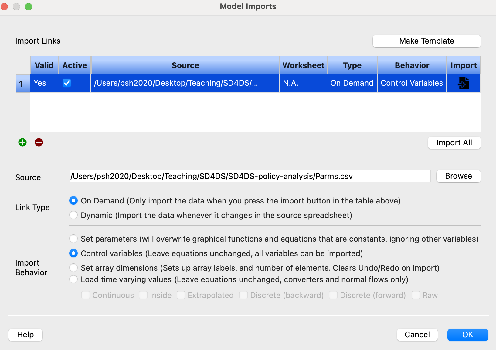
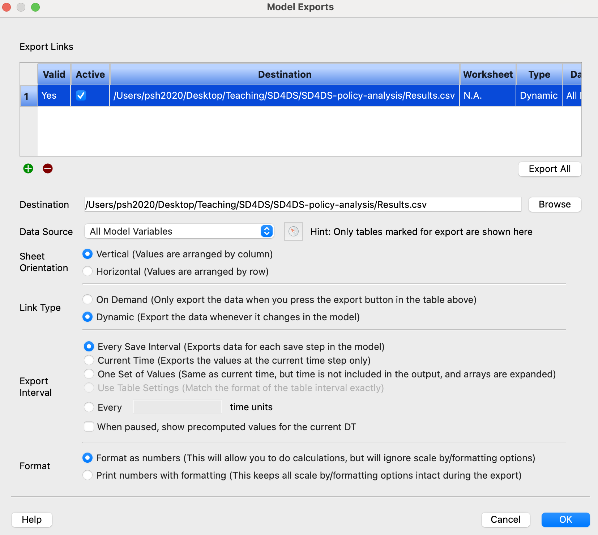
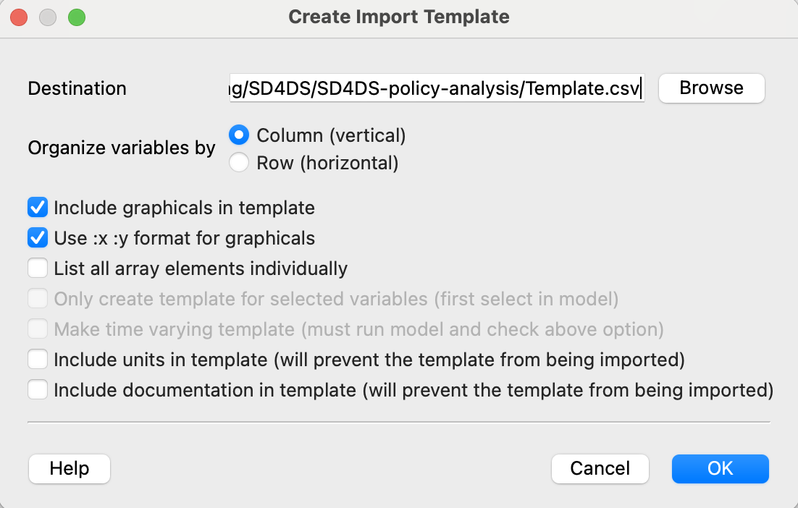

# Policy Analysis

This set of exercises provides an introduction to designing and running a policy analysis on the High Performance Computing (HPC) cluster using Stella Simulator. Although these can be set up and run with standard software packages (e.g., Stella Architect, Vensim) through the user interface, there are advantages of setting and running a policy analysis as a script on the HPC, especially for models with larger sets of potential intervention points and parameter space where one might want to conduct a sensitivity analysis of selected policies, including:

-   Transparency of simulation study including generation of values for parameters and initial conditions.
-   Replicability of studies when code is made advailable to reviewers and other researchers even if they do not have access to the commercial software.
-   Reproducibility of results by being able to re-run the analyses through scripts.
-   Efficiency of resources since long simulation runs can be initiated as a batch process on the HPC versus tying up a local computer.

## Overview

There are many ways to implement a policy analysis on the HPC including running Stella Simulator directly from R using the `system()` command, the approach presented here is optimized to make the best use of HPC resources. For example, running Stella simulator within an R environment by calling the `system()` creates a new environment in R that often takes longer than the actual simulation. Hence the approach taken here uses Bash and AWK scrits to manage the overall simulation that minimizes programming needed to set up and efficiently run a simulation as a batch job on the HPC. Table 1 provides an overview of files needed for conducting a policy analysis.

| File | Description |
|-------------------|-----------------------------------------------------|
| \<model\>.stmx | This is the Stella model with intervention points for the policy analysis |
| study.csv | This is a file describing all the scenarios to run for a policy analysis. The first row contains the list of variables that will set for each each scenario. It is important that the variable names in this first row have an exact match to the variables in the Stella model, otherwise, they will be ingored. The remaining rows define the values for each scenario. |
| Parms.csv | This is a file defining the values to use for the current scenario being simulated. The file can be empty when the file is initially created, but must be set up in the Stella model with a dynamic link for importing values. Contents of the Parms.csv file will be overwritten for each simulation. |
| Results.csv | This is a file where the output from the current scenario being simulated is exported. This can be an empty when the file is initially created, but must be set up in the Stella model with a dynamic link for exporting results. Contents of the Results.csv file will be overwritten for each simulation. |
| study1.slurm | This is the SLURM/Bash script that defines the resources requested (e.g., number of compute nodes, CPUs, memory, etc., name of the model and study.csv file to use, any R pre-simulation scripts (e.g., to sample random distributions and set up the study.csv file), calls the AWK script for actually simulating the study, and calls any post-simulation scripts (e.g., process the results from each study). This will need to be tailored for the specific simulation study to specify the model to simulate and study.csv file to use. |
| simulate_study.awk | This is an AWK script that reads and runs each of the scenarios in the study.csv file. Generally, there should not be a need modify this script. The scripts generates a Results_n.csv file for each scenario where n corresponds to the scenario number. Hence simulation study with 5 scenarios would have at the end of the study, Results_1.csv, Results_2.csv, Results_3.csv, Results_4.csv, and Results_5.csv. |
| process_results.R | This is an R script for combining the results files generated by the simulate_study.awk (i.e., Results_1.csv, ... , Results_n.csv) into a single file called study_results.RData, which can then be downloaded and used to analyzing and visualizing the results. |

: **Table 1**, Common files needed for running a policy analysis and their description

## 1. Modifying a model to conduct a policy analysis

When we conduct a policy analysis, we generally want to know how a specific policy might change the dynamics of the system. A common mistake is to change the parameter values of a model as a proxy for a policy experiement. Doing this is problematic because one is essentially starting the model in a different scenario as opposed to intervening in a scenario. Moreover, one will usually want to be able to test both the strength of the policy intervention (i.e., effect sizes) *and* the timing of the intervention.

A common way to do this is to introduce a policy intervention that is activated at a given time, typically with a step function, although other functions such as pulse, ramp or S-shaped curves might also be considered. It is also possible to consider the de-implementation of a policy by adding a second step function.

**Figure 1. I**nitial "Limits to Growth" model (limits to growth v1.stmx) before adding intervention points for policy analysis


Next, we'll use the "Intervention Point" module to make it easier and more consistent in how we're implementing the interventions in Stella (see Figure 2). This allows one to turn and off the intervention using the SW variable (0 = off, 1 = on) at given time T1 where the default value is midway between the start and stop time of the simulation and with an effect size (ES) that represents the proportion of increase over a base value (i.e., ES = 0 means no change, ES = 0.25 means a 25% increase). The resulting expression for Intervention Point is then,

```         
Intervention Point = 
IF SW = 1 AND TIME >= T1 THEN
  1 + STEP(ES, T1)
ELSE
  1
```

This will by default return a value of 1 when the intervention is not active and if the switch is active, a value of 1 before the policy is implemented at T1 and then a value of 1 + ES at and after T1.

**Figure 2.** "Intervention Point" model (Intervention Point.stmx)


We now need to think through where we can imagine and want to test potential interventions for our policy analysis. The most obvious places in the "Limits to Growth" model shown in Figure 1 are:

1.  Crude birth rate, which would correspond to interventions that increase the birth rate in a population.
2.  Mortality rate, which would correspond to interventions that decrease the mortality rate.
3.  Carrying capacity, which increases the overall ability of the ecological system to support the population.
4.  Effect of population size on births, which mitigates the effects of population density on births.

While we set up the interventions to directly modify each of these values, we will also want to be able to vary the initial values of the parameters, which will also help us see the effect of the interventions on the parameters and check to see if the intervention were implemented correctly in the simulation. An easy way to do this is to copy the variable and give copy a prefix, e.g., "Initial". A prefix of "Initial" is better than "init" in Stella because there is an INIT function, which if used in the model or part of a variable name, makes it hard to pull out the initial variables in larger models using a regular expression search. One can then add the links from the initial variable to the variable along with the interventions.

Note that the interventions assume that a direct effect of 1.5 *improves* the affected variable and one needs to consider that when including the effect of the variable. For example, in the "Limits to Growth" model, increasing the crude birth rate and decreasing the mortality rate are seen as "good" relative to the goal of increasing the population. So the effect of an intervention point on the crude birth rate would multiply the parameter by the effect of the intervention whereas the the effect of an intervention point on the mortality rate would be represented by dividing the mortality rate by the effect of intervention point:

```         
Max_Crude_Birth_Rate = Initial_Max_Crude_Birth_Rate * IP1_Crude_Birth_Rate.Intervention_Point
Mortality_Rate = Initial_Mortality_Rate / IP2_Mortality_Rate.Intervention_Point
```

Lastly, to avoid having too much structure around the intervention points distract from the model, it is often easier to have the interventions set up somewhere else in the model and then use ghost or shadow variables to represent the intervention effects.

The results from pulling all of this together for the "Limits to Growth" model are shown in Figure 3 below.

**Figure 3**. "Limits to Growth" model with intervention points set up for policy testing and analysis (limits to growth v2.stmx)


## 2. Setting up .csv files for dynamic links with model

Once the model has been set up with potential intervention points, we'll need to set up some .csv files for exchanging parameters and simulated results along with the dynamic links in our model. This can be an empty file, but what is critical is that the dynamic import link be set up in the model. An easy way to do this is simply use the Parms.csv file in this example.

It is important that this file be saved in the same directory as the model. Although the path shown in the source in Figure 4 is the absolute path, Stella actually uses a relative path to find the file. When setting up the dynamic import link, there is an option to "Set parameters" and "Control variables". Choose the latter because this does not overwrite the equations in a model.

**Figure 4.** Setting up the link for the Parms.csv import file

{width=50%}

After setting the Parms.csv file, a dynamic link for exporting results needs to be set up. Set the dynamic link to the Results.csv file in the same directory of the model. There is a choice to set the sheet orientation to vertical or horizontal. Select the vertical orientation as this conforms best to importing data as a data frame as shown in Figure 5. Other options include exporting all the variables and whether to export at every time step. For small models, this does not matter, but for larger models, exporting all the variables at every time step creates *very large* Results.csv files. Options to reduce the file size include saving results at a wider set of intervals and/or only exporting the variables of interest.

**Figure 5.** Setting up the link to the Results.csv export file



## 3. Setting up the study design and study.csv file

Once the basic dynamic links have been set up for importing and exporting data, one needs to set up the study design and study.csv file. The study.csv file should be uniquely named for each study (e.g., "Study 1.csv", "Study 2.csv", etc.).

The simulate_study.awk script uses the first row or header row of the study.csv file to identify the variable names for the simulation study, and it is ***critical*** that these match the variable names in the Stella model ***exactly*** because Stella will otherwise ignore the variables. The best way to ensure that the variable names are the same is create an import template in Stella by clicking the "Make Template" in the Model Imports form (Figure 4). Select the column (vertical) organization of variables, which generates a header row of all the variables in a model (Figure 6). This will create a Template.csv file that can be edited.

**Figure 6.** Setting up the link to the Results.csv export file

{width="493"}

Remove the variables (columns) that won't be used in the policy analysis and then set the values for each scenario. This can be done by editing the file, e.g., in Excel or Google Sheets, or writing a script that generates the desired set of scenarios.

Note that it is important to look and edit file carefully as this defines the variables that will be used to set up the simulation study. For example, if one used the "Intervention Point.stmx" structure to set up the intervention points, the structure assumes that T1 of the intervention is at a value of 50. However, if the stop time of the simulation is less than 50, the intervention will never be activated even when the switch is on.

```         
inline code that can be copied and pasted
```

## 4. Running the simulation study

```         
inline code that can be copied and pasted 
```

## 5. Summarizing and visualizing results

# On your own

things that can be done beyond the exercise

# Some things to note

comments/notes

# References

any references
