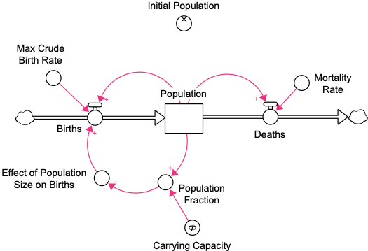
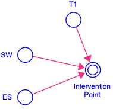
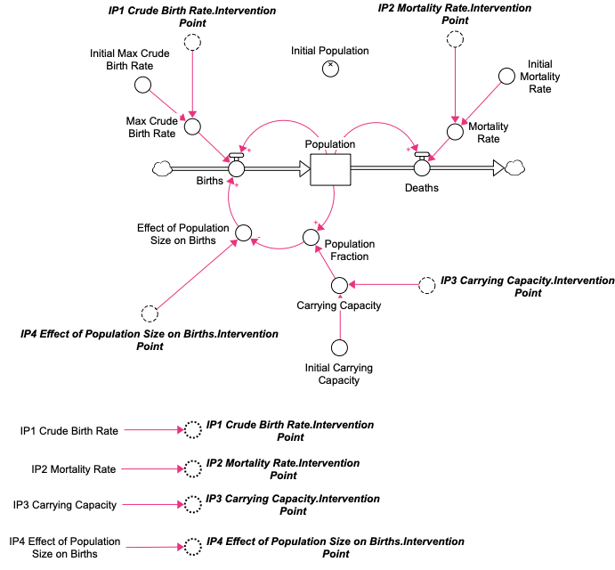

# Policy Analysis

This set of exercises provides an introduction to designing and running a policy analysis on the HPC using Stella Simulator. Although these can be set up and run with standard software packages (e.g., Stella Architect, Vensim) through the user interface, there are advantages of setting and running a policy analysis as a script on the HPC, especially for models with larger sets of potential intervention points and parameter space where one might want to conduct a sensitivity analysis of selected policies, including:

-   Transparency of simulation study including generation of values for parameters and initial conditions.
-   Replicability of studies when code is made advailable to reviewers and other researchers even if they do not have access to the commercial software.
-   Reproducibility of results by being able to re-run the analyses through scripts.
-   Efficiency of resources since long simulation runs can be initiated as a batch process on the HPC versus tying up a local computer.

# Exercises

## 1. Modifying a model to conduct a policy analysis

When we conduct a policy analysis, we generally want to know how a specific policy might change the dynamics of the system. A common mistake is to change the parameter values of a model as a proxy for a policy experiement. Doing this is problematic because one is essentially starting the model in a different scenario as opposed to intervening in a scenario. Moreover, one will usually want to be able to test both the strength of the policy intervention (i.e., effect sizes) *and* the timing of the intervention.

A common way to do this is to introduce a policy intervention that is activated at a given time, typically with a step function, although other functions such as pulse, ramp or S-shaped curves might also be considered. It is also possible to consider the de-implementation of a policy by adding a second step function.

**Figure 1. I**nitial "Limits to Growth" model (limits to growth v1.stmx) before adding intervention points for policy analysis



Next, we'll use the "Intervention Point" module to make it easier and more consistent in how we're implementing the interventions in Stella (see Figure 2). This allows one to turn and off the intervention using the SW variable (0 = off, 1 = on) at given time T1 where the default value is midway between the start and stop time of the simulation and with an effect size (ES) that represents the proportion of increase over a base value (i.e., ES = 0 means no change, ES = 0.25 means a 25% increase). The resulting expression for Intervention Point is then,

```         
Intervention Point = 
IF SW = 1 AND TIME >= T1 THEN
  1 + STEP(ES, T1)
ELSE
  1
```

This will by default return a value of 1 when the intervention is not active and if the switch is active, a value of 1 before the policy is implemented at T1 and then a value of 1 + ES at and after T1.

**Figure 2.** "Intervention Point" model (ntervention Point.stmx)



We now need to think through where we can imagine and want to test potential interventions for our policy analysis. The most obvious places in the "Limits to Growth" model shown in Figure 1 are:

1.  Crude birth rate, which would correspond to interventions that increase the birth rate in a population.
2.  Mortality rate, which would correspond to interventions that decrease the mortality rate.
3.  Carrying capacity, which increases the overall ability of the ecological system to support the population.
4.  Effect of population size on births, which mitigates the effects of population density on births.

While we set up the interventions to directly modify each of these values, we will also want to be able to vary the initial values of the parameters, which will also help us see the effect of the interventions on the parameters and check to see if the intervention were implemented correctly in the simulation. An easy way to do this is to copy the variable and give copy a prefix, e.g., "Initial". A prefix of "Initial" is better than "init" in Stella because there is an INIT function, which if used in the model or part of a variable name, makes it hard to pull out the initial variables in larger models using a regular expression search. One can then add the links from the initial variable to the variable along with the interventions.

Note that the interventions assume that a direct effect of 1.5 *improves* the affected variable and one needs to consider that when including the effect of the variable. For example, in the "Limits to Growth" model, increasing the crude birth rate and decreasing the mortality rate are seen as "good" relative to the goal of increasing the population. So the effect of an intervention point on the crude birth rate would multiply the parameter by the effect of the intervention whereas the the effect of an intervention point on the mortality rate would be represented by dividing the mortality rate by the effect of intervention point:

```         
Max_Crude_Birth_Rate = Initial_Max_Crude_Birth_Rate * IP1_Crude_Birth_Rate.Intervention_Point
Mortality_Rate = Initial_Mortality_Rate / IP2_Mortality_Rate.Intervention_Point
```

Lastly, to avoid having too much structure around the intervention points distract from the model, it is often easier to have the interventions set up somewhere else in the model and then use ghost or shadow variables to represent the intervention effects.

The results from pulling all of this together for the "Limits to Growth" model are shown in Figure 3 below.

Figure 3. "Limits to Growth" model with intervention points set up for policy testing and analysis (limits to growth v2.stmx)



## 2. Setting up .csv files for dynamic links with model

The first step in setting up a policy analysis is to set up the .csv files for exchanging data with the Stella model. Although this can be done through a single Excel file using various sheets, it is easier and more generalizable to have one .csv file for each type of data.

```         
inline code that can be copied and pasted 
```

## 2. Second exercise in set

```         
inline code that can be copied and pasted
```

## 3. Third exercise in set

```         
inline code that can be copied and pasted 
```

# On your own

things that can be done beyond the exercise

# Some things to note

comments/notes

# References

any references
