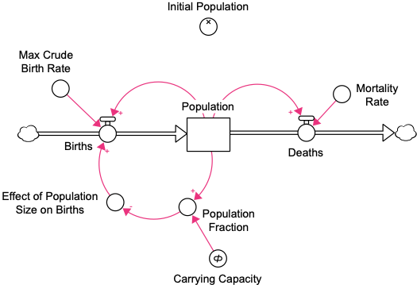
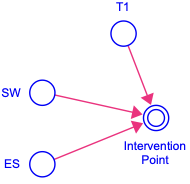
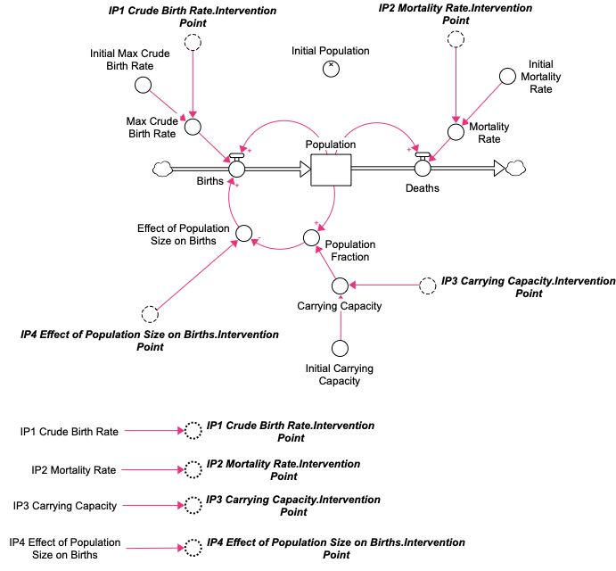
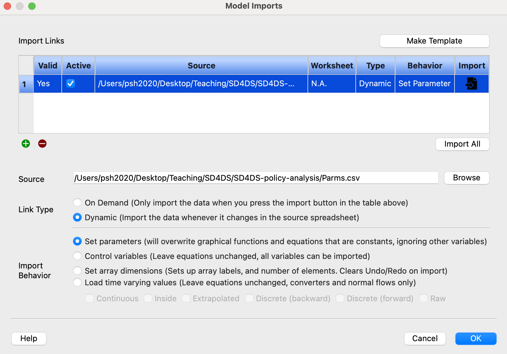
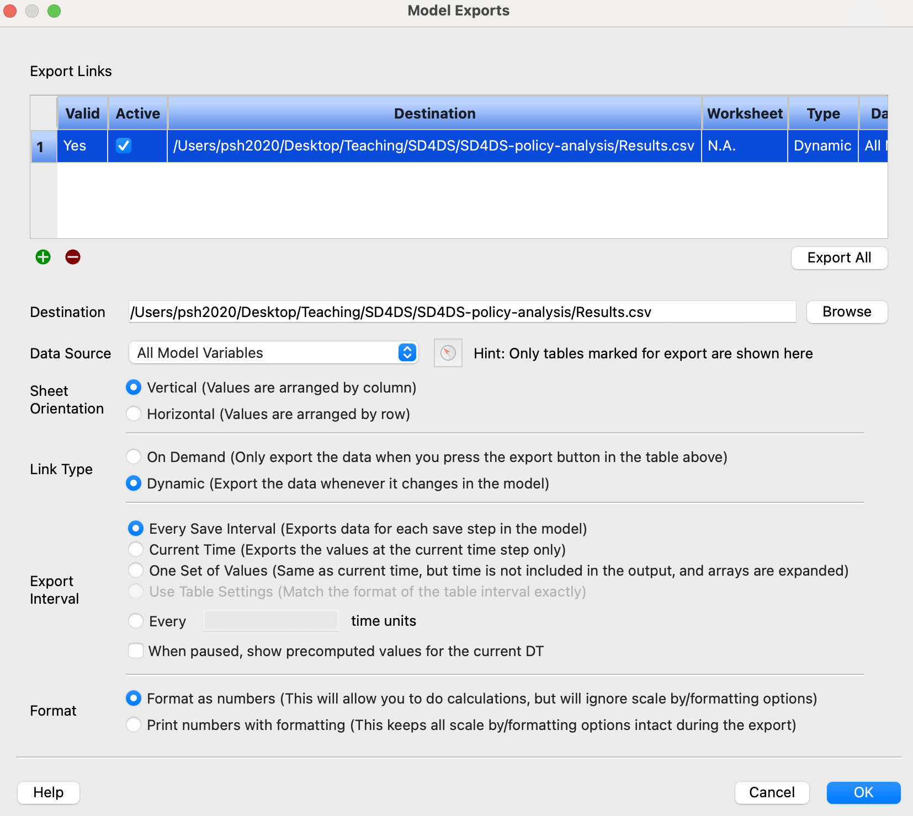
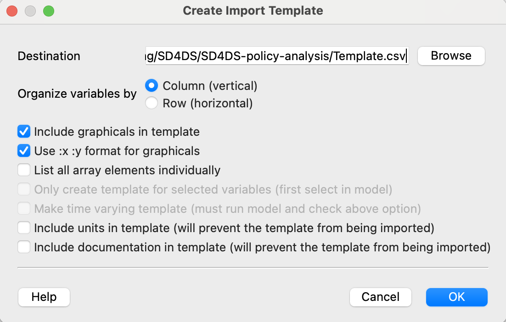
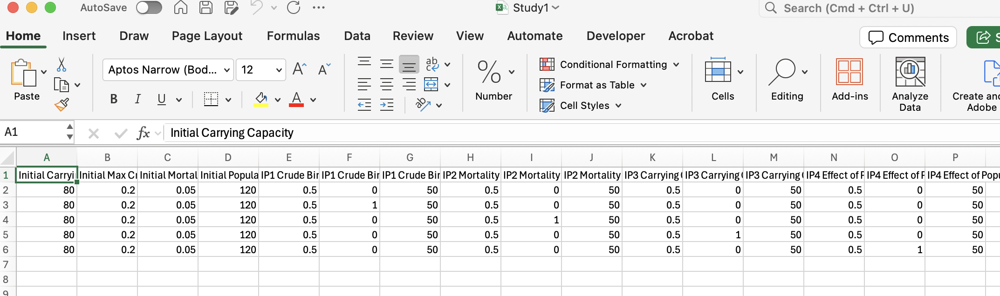
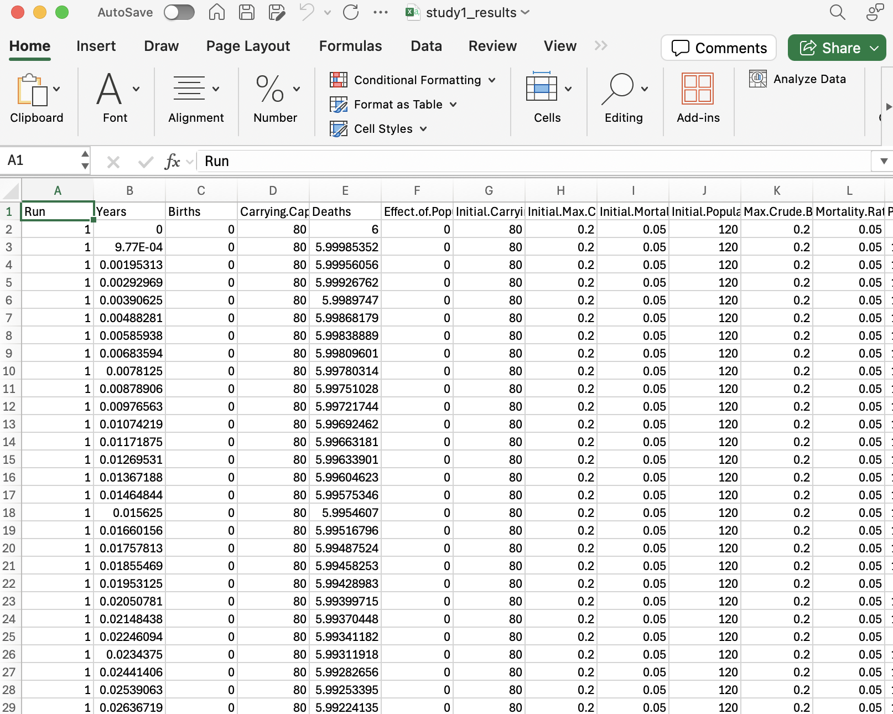
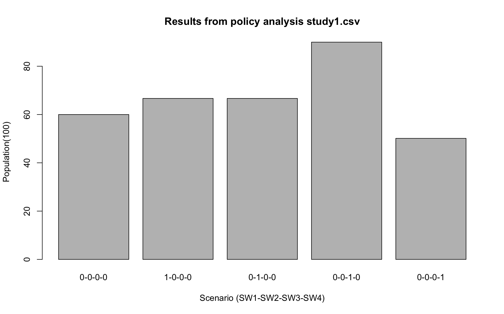

# Policy Analysis

This set of exercises from [SD4DS](https://github.com/CBSDLab/SD4DS) provides an introduction to designing and running a policy analysis on the High Performance Computing (HPC) cluster using Stella Simulator. Conducting a policy analysis allows a modeler to test different intervention places in the model and compare their impact on the desired outcome. This exercise will walk through building the intervention model structure in a Stella model, running the simulation, and measuring the outcome after different interventions as a graph plot in R. 

For more details on why we're doing this on the HPC as opposed to standard software pacakages (e.g. Stella Architect, Vensim) through the user interface, as well as the rationale for the coding languages chosen in this exercise, please read the [Deep Dive](https://github.com/CBSDLab/SD4DS-policy-analysis/blob/Callie-dev/README.md#deep-dive) section at the end of this exercise.


## Overview

To implement a policy analysis on the HPC, we present an approach that minimizes programming needed to set up and efficiently run a simulation as a batch job on the HPC. For more details on this approach, please read the [Deep Dive](https://github.com/CBSDLab/SD4DS-policy-analysis/blob/Callie-dev/README.md#deep-dive) section at the end of this exercise. 

Defining the policy outcome(s) of interest is a key step in conducting a policy analysis. All variables' values are available in simulation models, so there are a lot more options for outcomes in a simulation study than available in the real world. This means we have the opportunity to explore many different ways defining a policy outcome in a simulation study. For example, one could define an outcome of interest by simply maximizing (or minimizing) the value of some variable at the end of a simulation run, but other options include defining the improvement of some variable relative to the present time, defining outcomes as a ratio of two variables, the cumulative value as opposed to the final value, or some other set of multivariate outcome measures. One is really only constrained by the variables in a model and one's imagination.

For the purpose of this example, we're going to keep it simple and assume that the goal is to maximize the population of a system by 100 years. That is, we are ultimately interested in identifying the set of policies that will maximize the final population in our model (under the assumed initial conditions and parameter values in the model).

The following exercise walks through the seven steps to set up and run a policy analysis (below), beginning with a detailed example for setting up a model and running a univariate policy analysis, and then move onto examples that illustrate different types of policy analyses. Table 1 provides an overview of files needed for conducting a policy analysis.

1.  Get the files that are needed to run the simulations, which include files that define the studies and some scripts for running the simulations.
2.  Modify the Stella model to include switches representing the policies that will be turned on and off.
3.  Creating the dynamic links in the Stella model to import values for each scenario and to export results.
4.  Setting up the study design with the study.csv file where each row represents a scenario to be simulated along with the initial values and parameters.
5.  Modifying the Bash script for the [Slurm workload manager](https://en.wikipedia.org/wiki/Slurm_Workload_Manager) which is used to request and allocate the resources on the HPC.
6.  Running the simulation by submitting the Bash script as a batch job.
7.  Analyzing the results once the simulation is complete.

After the first time of setting up a model for a policy analysis and relevant files, most of the work will focus on steps 4 and 7 with minor changes to the Bash script for each study.

## 1. Getting files for exercise from GitHub

This exercise walks through the details of setting up and running a policy analysis. To get an initial sense of the influence of individual policies on the dynamics of a system and outcomes, a good first step is simply to test what they impact of turning on an intervention is on the policy outcome(s) of interest. So we'll set this up and run a univariate policy analysis where we simply turn policies on and off at the default time of 50 years, which is midway in the "Limits to Growth.stmx" time horizon.

To get and run these examples, log into the HPC, start a terminal, change to the SD4DS directory for these exercises (e.g., see earlier exercises on setting up such a directory), clone the SD4DS-policy-analysis repository, and then change the working directory to the SD4DS-policy-analysis:

```         
git clone https://github.com/CBSDLab/SD4DS-policy-analysis.git
cd SD4DS-policy-analysis
```
An overview of the each type of file is provided in Table 1. 

| File | Description |
|--------------------------|----------------------------------------------|
| \<model\>.stmx | This is the Stella model with intervention points for the policy analysis |
| study.csv | This is a file describing all the scenarios to run for a policy analysis. The first row contains the list of variables that will set for each each scenario. It is important that the variable names in this first row have an exact match to the variables in the Stella model, otherwise, they will be ingored. The remaining rows define the values for each scenario. |
| Parms.csv | This is a file defining the values to use for the current scenario being simulated. The file can be empty when the file is initially created, but must be set up in the Stella model with a dynamic link for importing values. Contents of the Parms.csv file will be overwritten for each simulation. |
| Results.csv | This is a file where the output from the current scenario being simulated is exported. This can be an empty when the file is initially created, but must be set up in the Stella model with a dynamic link for exporting results. Contents of the Results.csv file will be overwritten for each simulation. |
| simulate_study1.sh | This is the SLURM/Bash script that defines the resources requested (e.g., number of compute nodes, CPUs, memory, etc., name of the model and study.csv file to use, any R pre-simulation scripts (e.g., to sample random distributions and set up the study.csv file), calls the AWK script for actually simulating the study, and calls any post-simulation scripts (e.g., process the results from each study). This will need to be tailored for the specific simulation study to specify the model to simulate and study.csv file to use. |
| simulate_scenarios.awk | This is an AWK script that reads and runs each of the scenarios in the study.csv file. Generally, there should not be a need modify this script. The scripts generates a Results_n.csv file for each scenario where n corresponds to the scenario number. Hence simulation study with 5 scenarios would have at the end of the study, Results_1.csv, Results_2.csv, Results_3.csv, Results_4.csv, and Results_5.csv. |
| process_results.R | This is an R script for combining the results files generated by the simulate_study.awk (i.e., Results_1.csv, ... , Results_n.csv) into a single file called study_results.RData, which can then be downloaded and used to analyzing and visualizing the results. |

**Table 1**. Common files needed for running a policy analysis and their description

## 2. Modifying a model to conduct a policy analysis

When we conduct a policy analysis, we generally want to know how a specific policy might change the dynamics of the system. A common mistake is to change the parameter values of a model as a proxy for a policy experiement. Doing this is problematic because one is essentially starting the model in a different scenario as opposed to intervening in a scenario. Moreover, one will usually want to be able to test both the strength of the policy intervention (i.e., effect sizes) *and* the timing of the intervention.

A common way to do this is to introduce a policy intervention that is activated at a given time, typically with a step function, although other functions such as pulse, ramp or S-shaped curves might also be considered. It is also possible to consider the de-implementation of a policy by adding a second step function.

**Figure 1. I**nitial "Limits to Growth" model (limits to growth v1.stmx) before adding intervention points for policy analysis



Next, we'll use the "Intervention Point" module to make it easier and more consistent in how we're implementing the interventions in Stella (see Figure 2). This allows one to turn and off the intervention using the SW variable (0 = off, 1 = on) at given time T1 where the default value is midway between the start and stop time of the simulation and with an effect size (ES) that represents the proportion of increase over a base value (i.e., ES = 0 means no change, ES = 0.25 means a 25% increase). The resulting expression for Intervention Point is then,

```         
Intervention Point = 
IF SW = 1 AND TIME >= T1 THEN
  1 + STEP(ES, T1)
ELSE
  1
```

This will by default return a value of 1 when the intervention is not active and if the switch is active, a value of 1 before the policy is implemented at T1 and then a value of 1 + ES at and after T1.

**Figure 2.** "Intervention Point" model (Intervention Point.stmx)



We now need to think through where we can imagine and want to test potential interventions for our policy analysis. The most obvious places in the "Limits to Growth" model shown in Figure 1 are:

1.  Crude birth rate, which would correspond to interventions that increase the birth rate in a population.
2.  Mortality rate, which would correspond to interventions that decrease the mortality rate.
3.  Carrying capacity, which increases the overall ability of the ecological system to support the population.
4.  Effect of population size on births, which mitigates the effects of population density on births.

While we set up the interventions to directly modify each of these values, we will also want to be able to vary the initial values of the parameters, which will also help us see the effect of the interventions on the parameters and check to see if the intervention were implemented correctly in the simulation. An easy way to do this is to copy the variable and give copy a prefix, e.g., "Initial". A prefix of "Initial" is better than "init" in Stella because there is an INIT function, which if used in the model or part of a variable name, makes it hard to pull out the initial variables in larger models using a regular expression search. One can then add the links from the initial variable to the variable along with the interventions.

Note that the interventions assume that a direct effect of 1.5 *improves* the affected variable and one needs to consider that when including the effect of the variable. For example, in the "Limits to Growth" model, increasing the crude birth rate and decreasing the mortality rate are seen as "good" relative to the goal of increasing the population. So the effect of an intervention point on the crude birth rate would multiply the parameter by the effect of the intervention whereas the the effect of an intervention point on the mortality rate would be represented by dividing the mortality rate by the effect of intervention point:

```         
Max_Crude_Birth_Rate = Initial_Max_Crude_Birth_Rate * IP1_Crude_Birth_Rate.Intervention_Point
Mortality_Rate = Initial_Mortality_Rate / IP2_Mortality_Rate.Intervention_Point
```

Lastly, to avoid having too much structure around the intervention points distract from the model, it is often easier to have the interventions set up somewhere else in the model and then use ghost or shadow variables to represent the intervention effects.

The results from pulling all of this together for the "Limits to Growth" model are shown in Figure 3 below.

**Figure 3**. "Limits to Growth" model with intervention points set up for policy testing and analysis (limits to growth v2.stmx)



## 3. Setting up .csv files for dynamic links with model

Once the model has been set up with potential intervention points, we'll need to set up some .csv files for exchanging parameters and simulated results along with the dynamic links in our model. This can be an empty file, but what is critical is that the dynamic import link be set up in the model. An easy way to do this is simply use the Parms.csv file in this example.

It is important that this file be saved in the same directory as the model. Although the path shown in the source in Figure 4 is the absolute path, Stella actually uses a relative path to find the file. When setting up the dynamic import link, there is an option to "Set parameters" and "Control variables". Choose the latter because this does not overwrite the equations in a model.

**Figure 4.** Setting up the link for the Parms.csv import file



After setting the Parms.csv file, a dynamic link for exporting results needs to be set up. Set the dynamic link to the Results.csv file in the same directory of the model. There is a choice to set the sheet orientation to vertical or horizontal. Select the vertical orientation as this conforms best to importing data as a data frame as shown in Figure 5. Other options include exporting all the variables and whether to export at every time step. For small models, this does not matter, but for larger models, exporting all the variables at every time step creates *very large* Results.csv files. Options to reduce the file size include saving results at a wider set of intervals and/or only exporting the variables of interest.

**Figure 5.** Setting up the link to the Results.csv export file



## 4. Setting up the study design and study.csv file

Once the basic dynamic links have been set up for importing and exporting data, we need to set up the study.csv file. This is the file that essentially defines the simulation study for our policy analysis, i.e., the parameter values and switches/timings of policies we want to turn on and off. If we have multiple studies, each study should have be uniquely named, e.g., Study1.csv, Study2.csv, etc. or Univariate_study.csv, Multivariate_study.csv, etc.

This step 4 is summarized in the Create_study1.R script, but we will walk through the steps that created this script. 

The simulate_study.awk script uses the first row or header row of the study.csv file to identify the variable names for the simulation study, and it is ***critical*** that these match the variable names in the Stella model ***exactly*** because Stella will otherwise ignore the variables. The best way to ensure that the variable names are the same is create an import template in Stella by clicking the "Make Template" in the Model Imports form (Figure 4). Select the column (vertical) organization of variables, which generates a header row of all the variables in a model (Figure 6). This will create a Template.csv file that can be edited.

**Figure 6.** Creating a template for importing variables

{width="493"}

One can remove the variables (columns) that won't be used in the policy analysis and then set the values for each scenario. This can be done by editing the file, e.g., in Excel or Google Sheets, or writing a script that generates the desired set of scenarios. This makes it easier to see and manage the variabless defining the policy scenario.

Note that it is important to look and edit file carefully as this defines the variables that will be used to set up the simulation study. For example, if one used the "Intervention Point.stmx" structure to set up the intervention points, the structure assumes that T1 of the intervention is at a value of 50. However, if the stop time of the simulation is less than 50, the intervention will never be activated even when the switch is on. This is not a problem for the "Limits to Growth" model because the time horizon ranges from 0 to 100 years, so a value of 50 years is midway through the simulation run.

Although one can set up the Study.csv file manually, beyond a few rows to simulate, it quickly becomes tedious and error prone. A better way to do this is to write and run a short script that reads in the template, generates a data frame defining the simulation study, and then creates the desired Study.csv file.

We start by reading in the Template.csv file into R.

```{r read Template}
library(readr)
Template <- read_csv("Template.csv")
```

We then create the study1_df data frame to store our result and get a vector that identifies the switches in our model. Note that it's helpful to follow a convention in using prefixes or suffixes for switches, effect sizes, etc., that makes this step easy without having write out lists of variables.

```{r create study1_df data frame}
# Create the study1_df
study1_df <- Template

# Find the columns with the policy switches
SW_vec <- grep("SW", names(Template))
```

From here, we loop through the switches by going through each index value that we identified as a switch, turn the switch on, and add the vector to the study1_df we are creating.

```{r loop through switches}
for (sw in SW_vec) {
  # create a temporary row from the first row of the base simulation
  tmp <- study1_df[1,]  
  
  # set the switch to 1 (on)
  tmp[,sw] <- 1
  
  # add the row to the simulation study data frame
  study1_df <- rbind(study1_df,tmp)
}
```

The last step is writing the Study1.csv files with our results.

```{r write csv file}
# write the results to the Study1.csv
write_csv(study1_df,"study1.csv")
```

Once we have created the Study1.csv file, we should be able to view and see the results where one can see each row has a different switch activated (see Figure 6). We are now ready to run the simulation model.

**Figure 6.** Resulting Study1.csv file as viewed in Excel



## 5. Modifying the Bash script

Now we are *almost* ready to run the simulation. The "simulate_study_template.sh" Bash script has several elements that need to be modified for each simulation study, hence it is a good practice to copy the template script and give it a name unique to each study, e.g., "simulate_study1.sh". Below is the overall script that will need to be modified.

```         
#!/bin/bash
#SBATCH -N 1
#SBATCH -c 1
#SBATCH -t 1:00:00
#SBATCH --output=my.stdout 
#SBATCH --mail-user=<your email address>
#SBATCH --mail-type=ALL 
#SBATCH --job-name="<name of study>"

#SBATCH -o serial-R.out%j # capture jobid in output file name

# run simulation study using AWK script
awk -f simulate_scenarios.awk -v MODEL="<Stella .stmx model>" <Study.csv file>

# load R module to process results
module load R/4.1.2-foss-2021b
Rscript process_results.R

# copy processed results to study results file
cp study_results.RData <name of study>.RData
```

First, change the <your email address> to your email address. This is the email address that will be used to send you an email notification when the job has started and finished, which is very helpful for long running simulations.

```         
#SBATCH --mail-user=<your email address>
```

Next, assign a job name, e.g., "policy analysis study 1". This becomes especially helpful as you start to design and submit multiple simulation batch jobs (e.g., "policy analysis study 1","policy analysis study 2", etc.) so you can keep track in email notifications on which jobs have started and which have finished.

```         
#SBATCH --job-name="<name of study>"
```

Next, you'll need to modify the following line to provide the simulation model you want to run and the study.csv file.

```         
    awk -f simulate_study.awk -v MODEL="<Stella .stmx model>" <Study.csv file>
```

For this first study, the modified model we're using is "limits to growth v2.stmx" and the study.csv file is "study1.csv", so it should look something like the following:

```         
    awk -f simulate_study.awk -v MODEL="limits to growth v2.stmx" study1.csv
```

The last modification is copying the results from processing the simulations to a file that we want to keep and download for analyzing and plotting the results. The "process_results.R"" script saves the processed output in a "study_results.csv". Saving the results to a .csv file makes it easy to download, analyze and plot results using a variety of software programs including Excel, R, Python, SAS, SPSS, etc. Copying the results at the end to a name unique to the study allows one to keep the results and avoids risking overwriting the results in a different study. To set the unique name of the study results at the end of the simulation, replace <name of study> with something unique to the study, e.g., "study1_results.csv".

```         
cp study_results.csv <name of study>.csv
```

After the modifications and saving the file to "simulate_study1.sh", you should have something like the following with your own email address:

```         
#!/bin/bash
#SBATCH -N 1
#SBATCH -c 1
#SBATCH -t 1:00:00
#SBATCH --output=my.stdout 
#SBATCH --mail-user=<your email address>
#SBATCH --mail-type=ALL 
#SBATCH --job-name="policy analysis study 1"

#SBATCH -o serial-R.out%j # capture jobid in output file name

# run simulation study using AWK script
awk -f simulate_scenarios.awk -v MODEL="limits to growth v2.stmx" "study1.csv""

# load R module to process results
module load R/4.1.2-foss-2021b
Rscript process_results.R

# copy processed results to study results file
cp study_results.csv study1_results.csv
```

## 6. Running the simulation study

Now we're ready to submit our job to the HPC using the following terminal command:

```         
sbatch simulate_study1.slurm
```

This SLURM script will request the resources, which be allocated and start start the job. You should receive an email notification when the job has started along with an second email when the job has completed. The completed job will provide an exit code of 0 (successful) or 1 (unsuccessful). The exit code only refers to whether the scripts ran and completed. Common reasons for an unsuccessful or failed job with exit code 1 include:

-   A valid email address was not provided for #SBATCH --mail-user=<your email address>
-   A typo in one or more the file names you provided in the SLURM script.
-   One or more files are not available in the working directory.
-   Resources are not available, e.g., the R/4.1.2-foss-2021b module needed to call the R script for processing results is no longer available on the HPC.

The study1_results.csv can be downloaded and opened in Excel (see Figure 7). It's a large file with every variable for every time step for each of the scenarios with more than 512,000 rows or 80 MB of data and this is for a small model! For larger models or more extensive simulation studies, combining all of the results in this way within the "process_results.R" script might not work as R has a limited amount of working memory that is requested and allocated when the job is submitted and not all the variables would be needed for the analysis and plotting. Hence it is likely that one will want to customize the "process_results.R" script for each simulation study.

**Figure 7.** Excel view of "study1_results.csv" file



## 7. Analyzing and visualizing results

Although one could in principle include code for analyzing and visualizing the results from a policy analysis in a customized version of the post simulation processing script (e.g., "process_results.R"), it is best to keep the generation of the simulation results and subsequent analysis and visualization in separate scripts. For example, figuring out how one wants to analyze and visualize the simulation results usually benefits from an interactive session and can be done on a local computer or laptop after downloading the results. And, one does not want to have to rerun the simulations just to see how a modification in the visualization looks.

The "analyze_study1.R" example shown below imports the "study1_results.csv" file, runs a few checks, and then generates a plot showing which policy had the highest final population at 100 years. Note that each scenario represents a combination of policy switches being turned on an off. In this case, we don't necessarily want all the specific values, just the scenario being simulated. The code below constructs a variable \`Scenario\` that represents which switches were turned on (1) or off (0) as a string representing SW1-SW2-SW3-SW4. Nothing special about this specific strategy for naming scenarios, and there are many ways to assign more meaningful names to a policy scenario.

```         
# import results
library(readr)
library(tidyverse)
study1_results <- read_csv("study1_results.csv")

# get the policy switch variables
vars <- names(study1_results)
SW_vec <- grep("SW", vars)

# check time horizon
range(study1_results$Years)
ftable(study1_results[study1_results$Years==100,SW_vec])

# create a vector to summarize the policy switches that are on
scenario <- apply(study1_results[,vars[SW_vec]],1, paste0, collapse="-")

# select the final population for comparisons against policy 
# scenarios
study1_results %>%
  mutate(Scenario = scenario) %>%
  filter(Years == 100) %>%
  mutate(`Final Population` = Population) %>%
  select(Scenario, `Final Population`) -> tmp

# plot the results from the policy analysis
barplot(tmp$`Final Population`,names = tmp$Scenario,
        xlab = "Scenario (SW1-SW2-SW3-SW4)",
        ylab = "Population(100)", 
        main = "Results from policy analysis study1.csv")
```

Running this code should generate the following plot of results from the policy analysis defined in study 1.

**Figure 8.** Plot of results summarizing policy analysis in study 1.



## Next steps and future directions

This exercise runs a simple univariate policy analysis where we turned only one policy on at a time. Variations of this might include exploring whether the timing of policy makes a difference and adding a feature to the switches that allows for the policy to be de-implemented, which is an emerging area of interest in implementation science. The next set of exercises will focus on testing combinations of policies.

For this exercise, future development includes improving the Bash script template to make use of variables instead of having to type the study name several times, and automating the use of the scratch drive to temporarily store the results from simulations.

## Deep Dive
Although these can be set up and run with standard software packages (e.g., Stella Architect, Vensim) through the user interface, there are advantages of setting and running a policy analysis as a script on the HPC, especially for models with larger sets of potential intervention points and parameter space where one might want to conduct a sensitivity analysis of selected policies, including:

-   Transparency of simulation study including generation of values for parameters and initial conditions.
-   Replicability of studies when code is made available to reviewers and other researchers even if they do not have access to the commercial software.
-   Reproducibility of results by being able to re-run the analyses through scripts.
-   Efficiency of resources since long simulation runs can be initiated as a batch process on the HPC versus tying up a local computer.

There are many ways to implement a policy analysis on the HPC including running Stella Simulator directly from R using the `system()` command, the approach presented here is optimized to make the best use of HPC resources. For example, running Stella simulator within an R environment by calling the `system()` creates a new environment in R that often takes longer than the actual simulation. Hence the approach taken here uses Bash and AWK scrits to manage the overall simulation that minimizes programming needed to set up and efficiently run a simulation as a batch job on the HPC.
